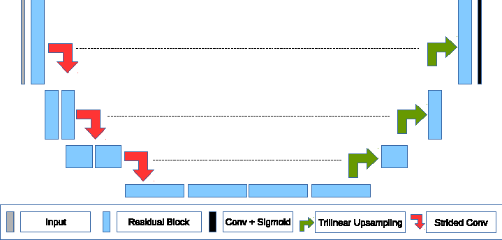
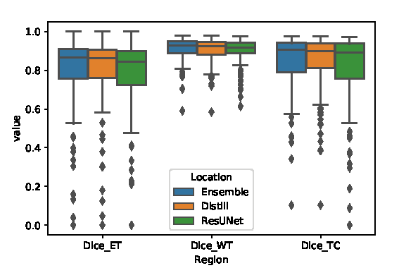

# Knowledge Distillation for Brain Tumor Segmentation
This code was written for participation in the [Brain Tumor Segmentation Challenge](http://braintumorsegmentation.org/) (BraTS) 2019.
The code is based on [the corresponding paper](https://arxiv.org/abs/2002.03688), where we employ knowledge distillation for automatic brain tumor segmentation.
First, we annotated unlabeled data with ensemble of different models. Then, we trained simple UNet model with residual blocks.
This repository contains the code for inferencing the distilled model.

## Network achitecture


### Results

<br/>


| Data        | WT           | ET  | TC |
| ------------- |:-------------:| :-----:|:----:|
| Cascaded UNet Val 2019 | 0.9      |    0.731 |0.833|
| Distilled Val 2019 | 0.904      |    0.756 |0.842|
| Distilled Test 2019 | 0.887      |    0.794 |0.829|


## Pre-trained model
Download checkpoint with the following [link](https://drive.google.com/file/d/1YX5B3fV_g7eDMIr2Ow5cN0CGNNIYn4Y0/view?usp=sharing), where the model has the name `brain-tumor-segmentation-0002`.
You can also download [onnx version](https://drive.google.com/file/d/1NhH51NgKJKhu0Bax_IKQ_Byvoe2bItPX/view?usp=sharing) for cpu inference with [OpenVino](https://software.intel.com/en-us/openvino-toolkit). 
The onnx model has a few modifications to match ONNX and OpenVino standards:
* It takes image of size `128x128x128` as an input
* It uses nearest neighbour upsampling instead of trilinear one
* It includes group norm operation from OpenVino

## How to perform prediction
1. Download BraTS data
2. Download pretrained model
3. Setup directory hierarchy
4. Run the script


Run the following command. Models root directory is a repository for all models. Change the output directory in the script.
```
python test.py --name=brain-tumor-segmentation-0002  --models_path=<model's root dir>
```

## Requirements
```
dicom                  0.9.9.post1
h5py                   2.9.0
jupyter-client         5.2.4      
jupyter-core           4.5.0      
jupyterlab             1.0.1      
jupyterlab-server      1.0.0    
matplotlib             3.1.1  
nibabel                2.4.1
numpy                  1.16.4      
opencv-python-headless 4.1.0.25    
openpyxl               2.6.2
pandas                 0.24.2
pickleshare            0.7.5      
Pillow                 6.1.0
protobuf               3.8.0
pydicom                1.2.2      
Pygments               2.4.2
PyWavelets             1.0.3
scikit-image           0.15.0      
scikit-learn           0.21.2      
scipy                  1.3.0      
seaborn                0.9.0
SimpleITK              1.2.0      
six                    1.12.0      
sklearn                0.0 
tensorboardX           1.8
torch                  1.2.0      
torchvision            0.4.0
tqdm                   4.32.2
```

## Citation

Lachinov D., Shipunova E., Turlapov V. (2020) Knowledge Distillation for Brain Tumor Segmentation. In: Crimi A., Bakas S. (eds) Brainlesion: Glioma, Multiple Sclerosis, Stroke and Traumatic Brain Injuries. BrainLes 2019. Lecture Notes in Computer Science, vol 11993. Springer, Cham

```
@InProceedings{10.1007/978-3-030-46643-5_32,
author="Lachinov, Dmitrii
and Shipunova, Elena
and Turlapov, Vadim",
editor="Crimi, Alessandro
and Bakas, Spyridon",
title="Knowledge Distillation for Brain Tumor Segmentation",
booktitle="Brainlesion: Glioma, Multiple Sclerosis, Stroke and Traumatic Brain Injuries",
year="2020",
publisher="Springer International Publishing",
address="Cham",
pages="324--332",
abstract="The segmentation of brain tumors in multimodal MRIs is one of the most challenging tasks in medical image analysis. The recent state of the art algorithms solving this task are based on machine learning approaches and deep learning in particular. The amount of data used for training such models and its variability is a keystone for building an algorithm with high representation power.",
isbn="978-3-030-46643-5"
}

```
